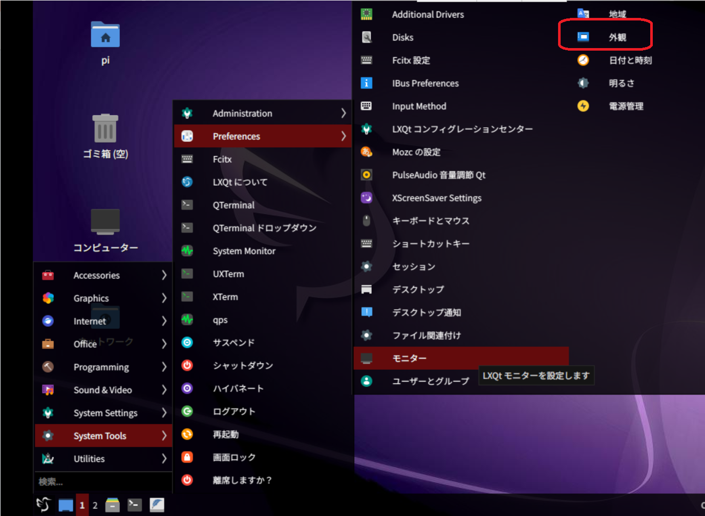
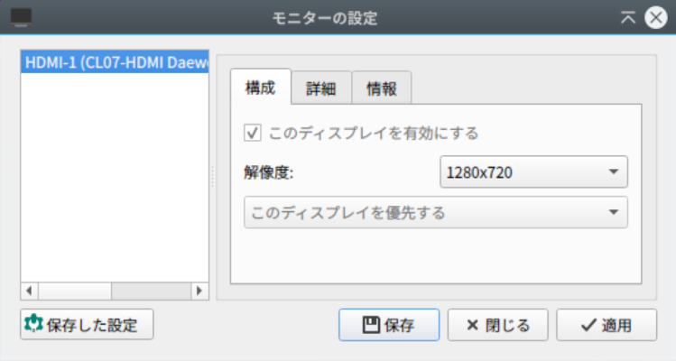
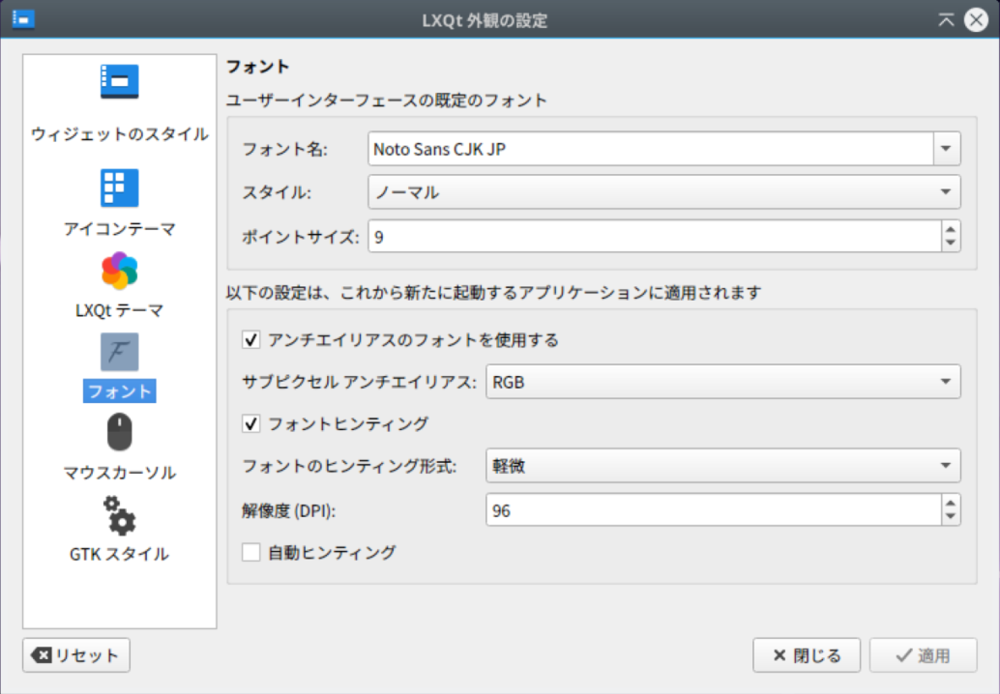

# Setup Raspberry Pi

`Raspberry Pi 5`に`Ubuntu`をインストールして設定する手順。

## Ubuntu と LXQt のインストール

[`Raspberry Pi Imager`](https://www.raspberrypi.com/software/)では`Wifi`設定なしで`SD`カードに書き込む。
`OS`は`Ubuntu24.04 64bit`サーバを選択する。

`2025/06/26`現在、`Ubuntu24.10`では`ROS2`がインストールできないし、`LXQt`も不具合が多い。

起動後に以下を実行する。

```shell
sudo apt update
sudo apt upgrade
sudo apt autoremove -y
sudo apt install net-tools emacs git
sudo apt install -y lxqt
# lxqtのインストールで失敗する場合は
# sudo apt install aptitude
# sudo aptitude install lxqt
# 最初の質問には n を選択し、次にダウングレードの提案があるので受け入れる。
sudo apt install -y lightdm
# lightdmで起動に失敗する場合はsddmに戻す。
sudo apt purge -y gdm3
sudo reboot
# ログイン時に`lxqt`を選択すること。
```

## NetworkManager

もしも、システムトレイのネットワークツールでWifiが検索できない場合、以下のファイルを編集する。

```shell
cd /etc/netplan/
ls
50-cloud-init.yaml # これを編集する。
sudo emacs 50-cloud-init.yaml -nw
```

以下のように追記する。

```text
network:
  version: 2
  renderer: NetworkManager  # この行を追加
```

`sudo netplan apply`を実行する。

## 日本語化

```shell
sudo apt install -y language-pack-ja-base language-pack-ja fcitx-mozc
sudo update-locale LANG=ja_JP.UTF-8
# sudo dpkg-reconfigure locales も必要かもしれない。
```

「設定」「言語サポート」から日本語化設定を行う。

## SSH鍵設定（オプション）

```shell
mkdir -p ~/.ssh/rpi5
chmod 700 ~/.ssh/rpi5
ssh-keygen -f ~/.ssh/rpi5/id_rsa_rpi5 -C "rpi5-key"
cat ~/.ssh/rpi5/id_rsa_rpi5.pub >> ~/.ssh/authorized_keys
chmod 600 ~/.ssh/authorized_keys
```

生成後は、`~/.ssh/rpi5`フォルダを自`PC`の`.ssh`にコピーして`config`を設定する。

## 壁紙

デスクトップ上を右クリックして、デスクトップの設定から`/usr/share/lxqt/wallpapers/waves-purple-logo.jpg`を選択。
設定後、デスクトップのアイコンが消えた場合はデスクトップの設定から詳細を確認する。

## 自動ログイン設定

### lightdmの場合

```shell
sudo emacs /etc/lightdm/lightdm.conf.d/50-myconfig.conf -nw
```

以下を書き込む。ユーザ名が`pi`である前提。

```shell
[SeatDefaults]
autologin-user=pi
autologin-user-timeout=0
user-session=LXQt
```

### sddmの場合

```shell
sudo mkdir -p /etc/sddm.conf.d/
sudo emacs /etc/sddm.conf.d/autologin.conf -nw
# 以下を書き込んで再起動する。
[Autologin]
User=pi
Session=lxqt
```

## VNC

```shell
./install_vnc.sh
```

## シリアルポート、オーバークロック

`Raspberry Pi 5`では`config.txt`を直接編集する。
`usrcfg.txt`はデフォルドでは使用されず、ファイルも無い。

`dtoverlay -h uart1-pi5`のようにすると、各`UART`の詳細を見ることができる。

```shell
cd /boot/firmware/
sudo cp config.txt config.txt.org
sudo emacs config.txt -nw
# 以下の数行を最下段の[all]に貼り付けて保存する。
[all]
enable_uart=1
dtoverlay=uart1-pi5
dtoverlay=uart4-pi5
# 以下、オーバークロックしたいなら有効にする。ただし、モバイルバッテリーでは不安定になる。
# arm_freq=2800
# gpu_freq=1000
# over_voltage_delta=50000
```

音声用設定は特に不要。

```shell
pactl info
# デフォルトシンク: alsa_output.platform-107c701400.hdmi.hdmi-stereo
# デフォルトソース: alsa_output.platform-107c701400.hdmi.hdmi-stereo.monitor
sudo apt install alsa-utils
speaker-test -t wav -c 2
```

## カメラ

```shell
./install_picamera.sh
sudo pip install picamera2
```

## その他の設定

`PCManFM`ファイルマネージャの設定から、ショートカットダブルクリック時に選択肢を出さないように設定する。


他に必要なソフトをインストールする。

- メモ帳代わりの`gedit`。
- 画像処理アプリの`gimp`。

```shell
sudo apt install -y geany gedit gimp
```

ミニディスプレイでは`GUI`が収まりきらず、見にくいことがあるので解像度を変更する。
ディスプレイの解像度を超えると、アイコンの細部が潰れることもあるので注意。



モニタ設定。



外観メニューからのフォント設定。


